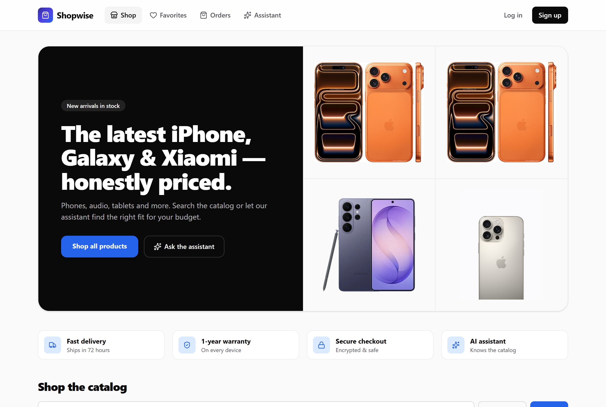
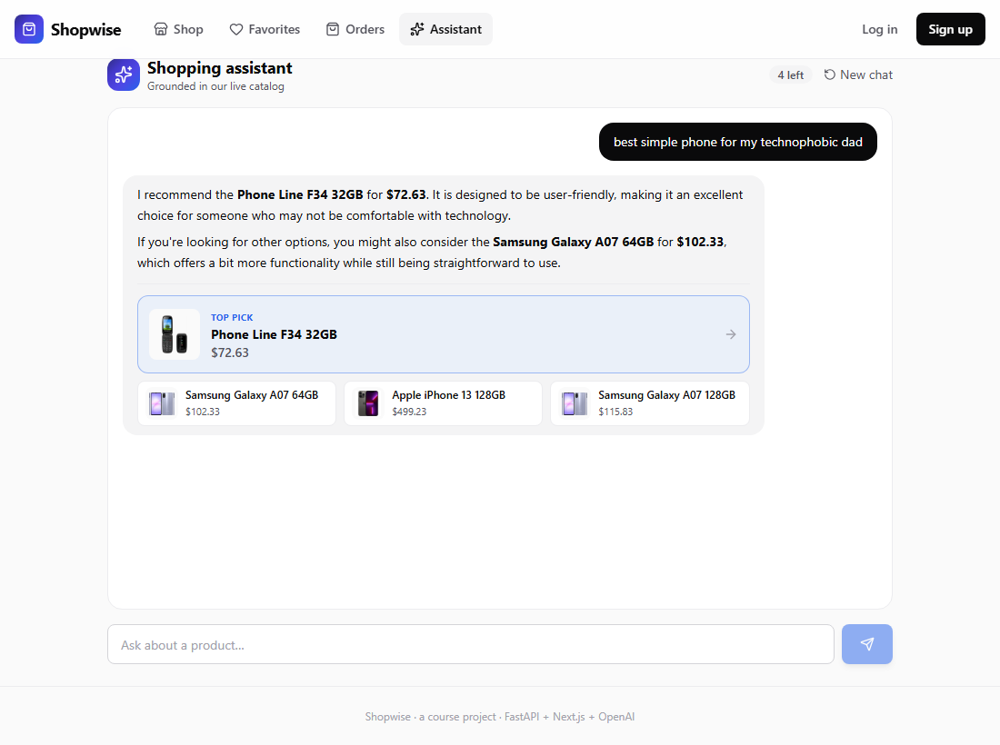
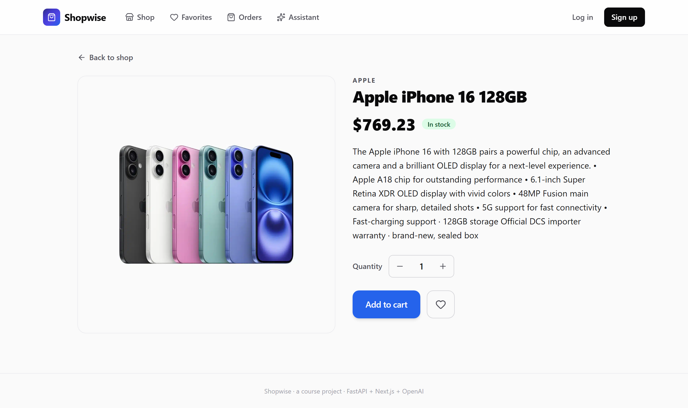
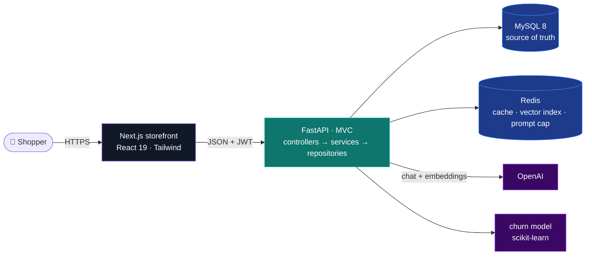
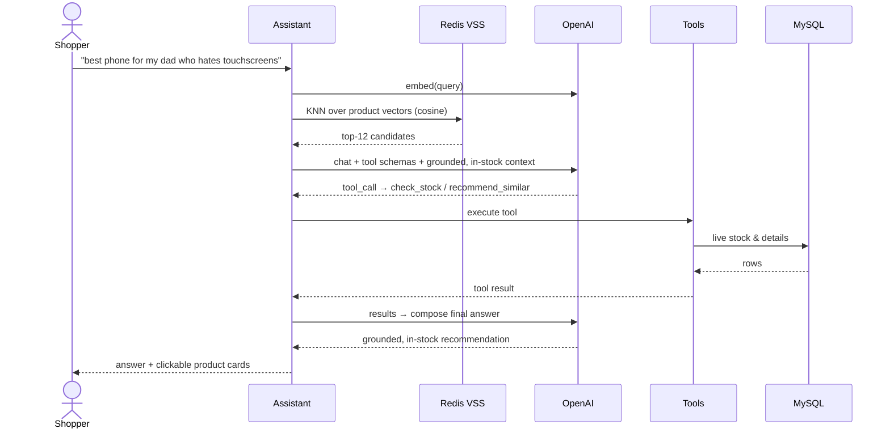
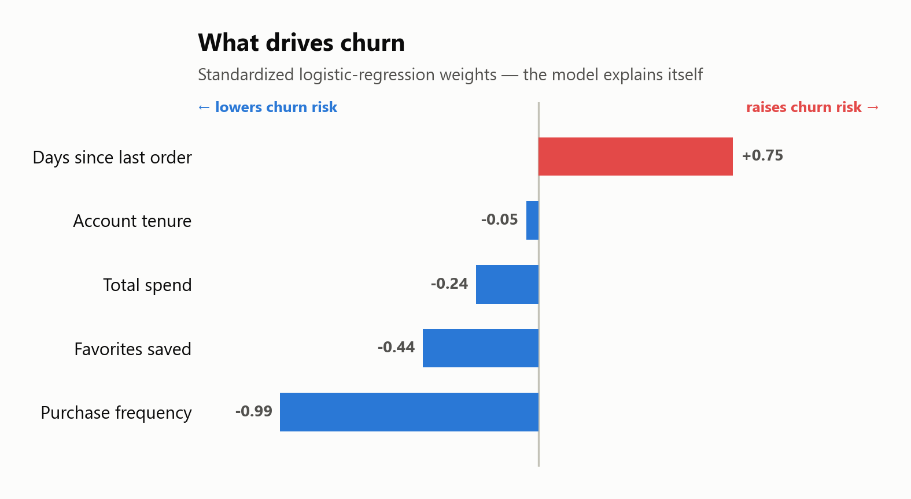
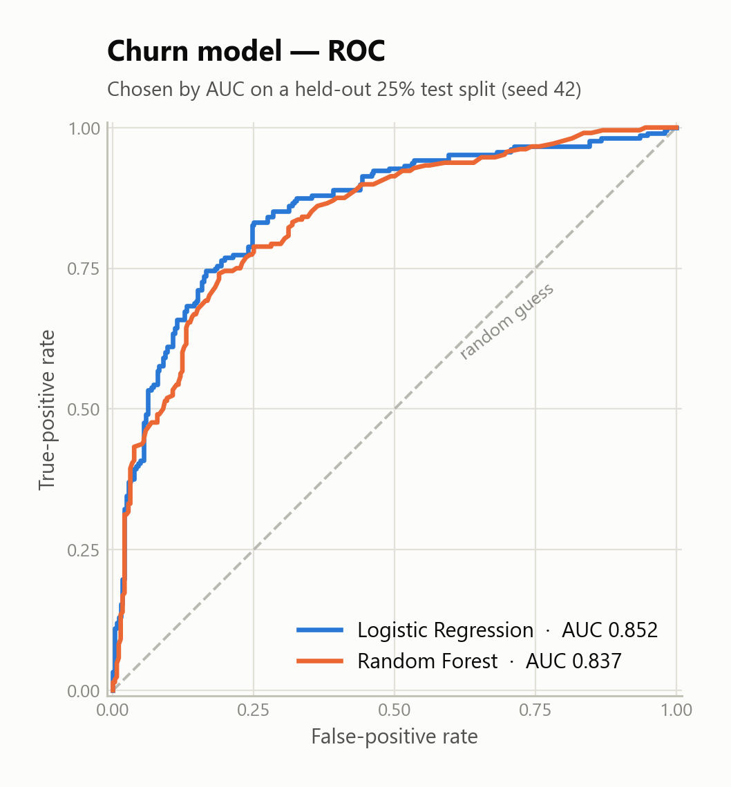
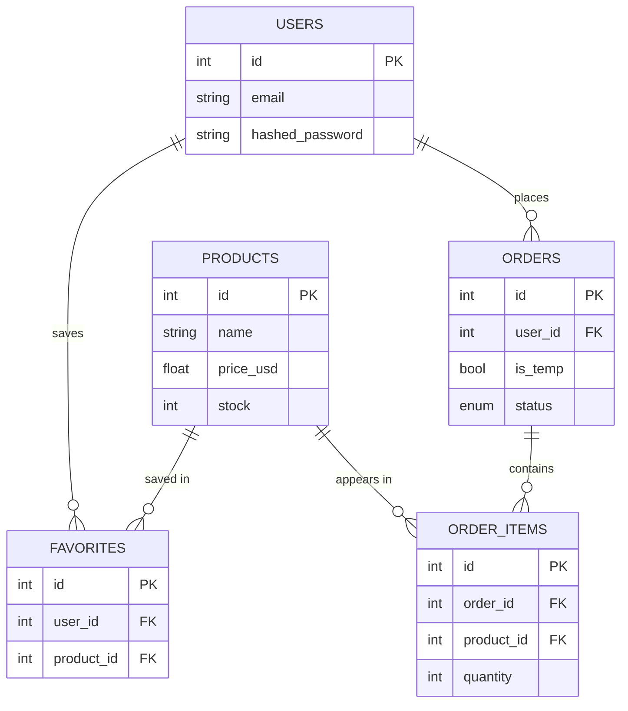
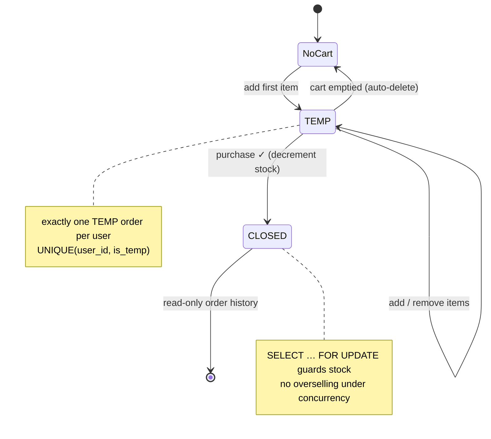
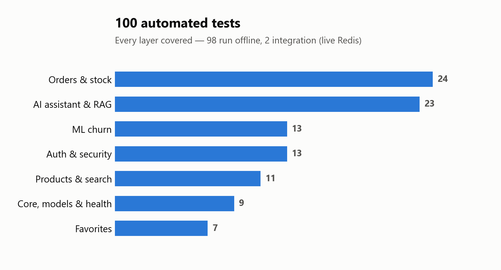

<div align="center">


<br/>

[](https://www.python.org/)
[](https://fastapi.tiangolo.com/)
[](https://www.mysql.com/)
[](https://redis.io/)
[](https://www.docker.com/)

[](https://platform.openai.com/)
[](https://scikit-learn.org/)
[](https://nextjs.org/)


**A full-stack electronics store where the backend and the AI are the stars.**
Browse a real catalog, search and filter, keep favorites, check out with live stock control, and
chat with an **agentic assistant that actually knows the inventory** — grounded in RAG, able to take actions.

[Highlights](#-highlights) · [What it does](#-what-it-does) · [Architecture](#️-architecture) · [The AI assistant](#-the-ai-assistant-the-centerpiece) · [The ML bonus](#-the-ml-bonus--churn-prediction) · [Run it](#-run-it-one-command)

</div>

---

<div align="center">
  
</div>

---

## ✨ Highlights

<div align="center">

| 🛍️ **151** | 🧪 **100** | 🧠 **6** | 📈 **0.852** | ⚡ **1** |
|:--:|:--:|:--:|:--:|:--:|
| real products | automated tests | live AI agent tools | churn ROC‑AUC | command to run it all |

</div>

- **Grounded, agentic AI** — a hand-written **RAG** pipeline over a **Redis vector index** plus a native **OpenAI tool-calling** loop. The assistant answers from *live* inventory and only ever recommends products that are **in stock**.
- **A real backend, done properly** — FastAPI with clean **MVC** layering, a transactional cart/checkout that **can't oversell**, and MySQL-as-truth / Redis-as-speed.
- **An explainable ML bonus** — a churn model that doesn't just score, it tells you **why** (see the chart below).
- **One command to run everything** — `docker compose up` boots the store, the API, the AI, and the ML, and seeds a 151-product catalog.

---

## 🎬 What it does

<table>
<tr>
<td width="50%" valign="top">

**🛒 Store**
- 151 real products (name, USD price, live stock) in a responsive grid
- Search: **multi-term OR** on names, plus **range filters** on price & stock (`<` `>` `=`)
- Favorites (login-gated, unique, persisted) and product detail pages
- Cart → checkout: **one TEMP order per user**, transactional purchase with **no overselling**
- Register / login / logout / delete-account (bcrypt + JWT), toasts on every action

</td>
<td width="50%" valign="top">

**🧠 AI assistant** *(the centerpiece)*
- **RAG** grounded in the live catalog via a **Redis vector index** (cosine KNN)
- **Agentic tool-calling** — search, semantic search, product details, live stock, recommend-similar, add-to-favorites
- Recommends **only in-stock** items and pivots to alternatives
- **5 prompts / session** cap (Redis); graceful degradation when OpenAI is off

**📈 ML bonus**
- `GET /ml/churn/{user_id}` — explainable churn probability + per-user reason codes

</td>
</tr>
</table>

<div align="center">
  
  
</div>

---

## 🏗️ Architecture



- **Backend** — FastAPI with a clean **MVC** layering (`controllers → services → repositories → models`), SQLAlchemy + Alembic, Pydantic schemas, centralized enums/config.
- **MySQL = truth, Redis = speed.** Redis caches the catalog, **holds the vector index**, and enforces the per-session prompt cap.
- **AI** — a hand-written RAG + agent loop (**no LangChain**); every OpenAI touchpoint is injectable, so the whole thing is **unit-tested offline**.
- **Frontend** — Next.js 16 / React 19 / Tailwind, JWT in `localStorage`, cart & favorites React contexts.

---

## 🤖 The AI assistant (the centerpiece)

Ask it *"the best phone for my dad who hates touchscreens"* and it embeds the question, retrieves the closest products from a **Redis vector index**, then runs an **agentic tool-loop** — calling real functions against the live database — before writing a grounded answer with clickable product cards.



**Why it's more than a chatbot wrapper**

- **Retrieval is real.** Products are embedded with `text-embedding-3-small` and indexed in Redis as `FLOAT32[1536]` vectors with a `FLAT` cosine KNN index — a from-scratch vector store, not a library black box.
- **Grounding is live.** Stock is read from MySQL *at answer time*, so the assistant never recommends something that just sold out.
- **It takes actions.** Six native OpenAI tools let it search, fetch details, check stock, recommend similar items, and add to favorites.
- **It fails gracefully.** No `OPENAI_API_KEY`? `/chat` returns a friendly "unavailable" message and the rest of the store works untouched — which is exactly why it's fully testable offline.

---

## 📊 The ML bonus — churn prediction

`GET /ml/churn/{user_id}` turns a customer's live **RFM** behaviour into a churn probability — and, because it's a standardized logistic regression, it can **explain every prediction**.

<div align="center">
<table><tr>
<td width="50%">
<picture>
  <source media="(prefers-color-scheme: dark)" srcset="docs/charts/churn-drivers-dark.png">
  
</picture>
</td>
<td width="50%">
<picture>
  <source media="(prefers-color-scheme: dark)" srcset="docs/charts/roc-dark.png">
  
</picture>
</td>
</tr></table>
</div>

- **Honest signal, not a toy.** The training set is a **class-conditional** synthetic process with deliberate class overlap and 8% label noise — so the model lands at a realistic **ROC-AUC ≈ 0.85**, not a suspicious 0.999.
- **Interpretable by design.** Logistic Regression beats Random Forest here *and* ships explainable weights: recency **raises** churn risk; frequency, favorites and spend **lower** it — exactly what you'd expect.
- **No train/serve skew.** The API scores users through the *same* feature code the model was trained on.

---

## 🗄️ Data model



## 🔄 Order lifecycle

The cart *is* an order in a `TEMP` state — enforced at the database level so a user can never have two open carts.



---

## 🚀 Run it (one command)

```bash
cp .env.example .env      # paste your OPENAI_API_KEY into .env
docker compose up --build
```

That starts **everything** — MySQL, Redis, the FastAPI API, and the Next.js storefront — runs database migrations, and **auto-seeds the catalog (151 real products)**.

<div align="center">

| Surface | URL |
|---|---|
| 🛍️ Storefront | http://localhost:3000 |
| ⚙️ API | http://localhost:8000 |
| 📖 Swagger (interactive API) | http://localhost:8000/docs |

</div>

**Two one-time steps to light up the AI + ML demos:**

```bash
docker compose exec backend python scripts/embed_products.py        # build the chat's vector index
docker compose exec backend python scripts/seed_synthetic_users.py  # customers for the churn demo
```

*(The chat index also builds lazily on first use. The assistant needs a real `OPENAI_API_KEY`; without one, `/chat` returns a friendly "unavailable" message and the rest of the app is unaffected.)*

---

## 🧪 Tested

<div align="center">
<picture>
  <source media="(prefers-color-scheme: dark)" srcset="docs/charts/tests-dark.png">
  
</picture>
</div>

```bash
cd backend && pytest              # 98 unit tests (SQLite; OpenAI mocked)
pytest -m integration             # 2 integration tests (live Redis vector search)
cd ../frontend && npm run build   # type-check + production build
```

Every layer is covered — auth, catalog/search, favorites, the transactional order engine, the AI tools & agent loop, and the ML pipeline. The AI and ML layers were also verified with **live smokes** (grounded chat + tool calls, churn scoring across 300 seeded users).

---

## 🗂️ Project layout

```
backend/        FastAPI app (app/), tests/, Dockerfile, Alembic migrations
  app/ai/       embeddings · Redis vector store · tools · the agent assistant
  app/ml/       churn features + model serving
frontend/       Next.js storefront (src/app, src/components, src/context)
ml_training/    synthetic dataset generator · churn training · report
data/           products.seed.json (151 products)
scripts/        seed_products · embed_products · seed_synthetic_users
docs/           design spec · per-phase plans · screenshots · chart source
```

<details>
<summary><b>🧰 Full tech stack</b></summary>

<br/>

| Layer | Tech |
|---|---|
| **API** | FastAPI, Pydantic, SQLAlchemy 2, Alembic, python-jose (JWT), bcrypt |
| **Data** | MySQL 8, Redis Stack (cache + `FT.SEARCH` vector index) |
| **AI** | OpenAI `chat.completions` + `text-embedding-3-small`, hand-written RAG & tool-loop |
| **ML** | scikit-learn (LogReg / RandomForest), pandas, numpy, joblib |
| **Frontend** | Next.js 16 (App Router, standalone), React 19, Tailwind v4, lucide-react, react-markdown |
| **Infra** | Docker multi-stage builds, docker-compose, pytest |

</details>

---

## 📚 Documentation

- The build was done in **nine documented phases** — foundation → auth → catalog → favorites → orders → **AI** → **ML** → **frontend** → polish.
- Design spec & per-phase build plans live in `docs/`.
- Every chart above is **regenerated from real project data** by [`docs/charts/make_charts.py`](docs/charts/make_charts.py) (the churn charts retrain the seed-42 model, so the numbers always match the training report).
